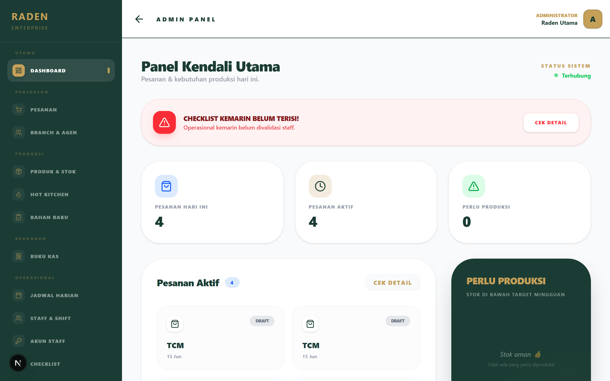
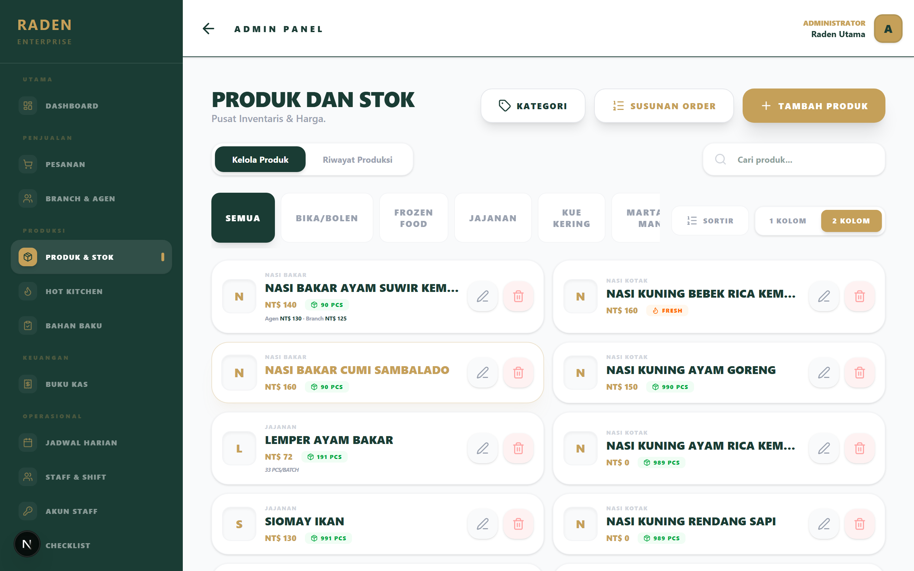
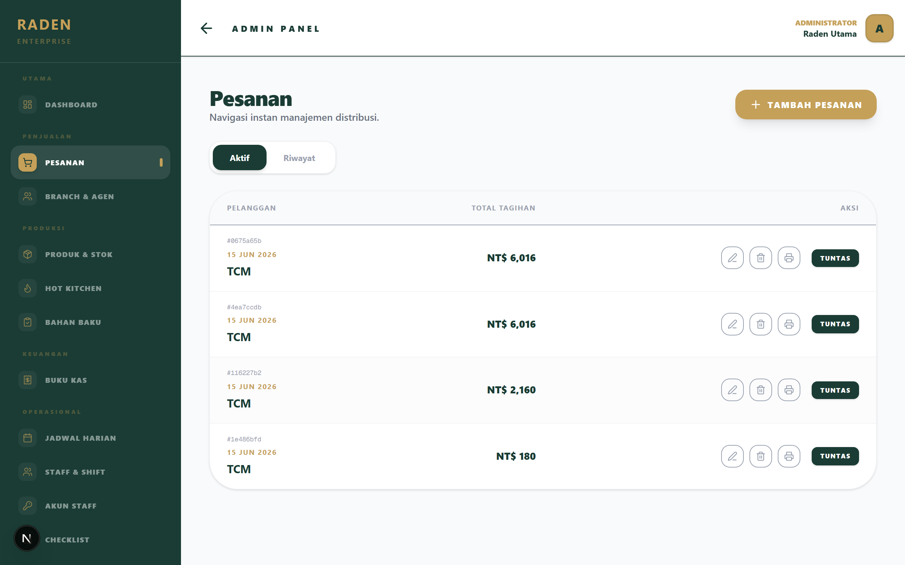
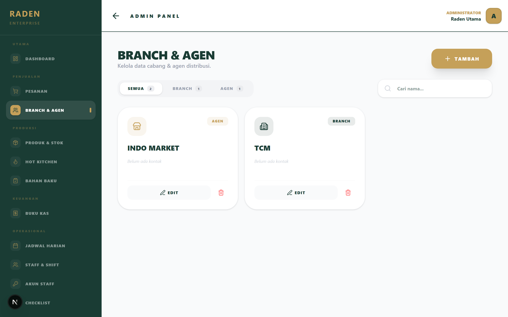
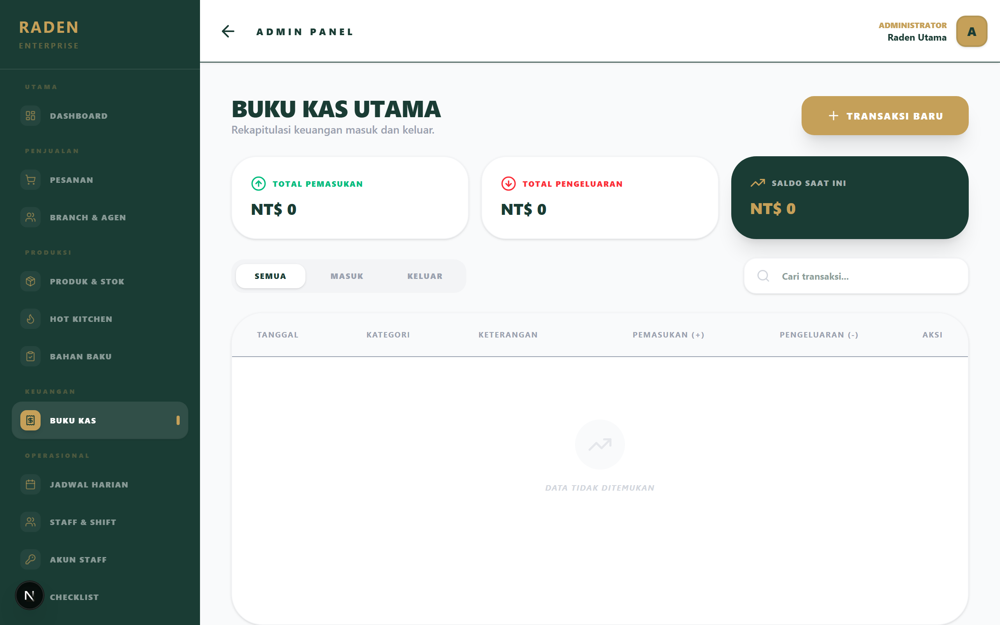
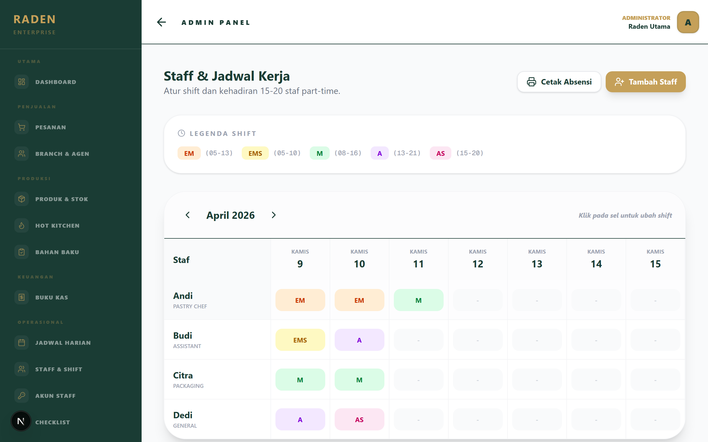
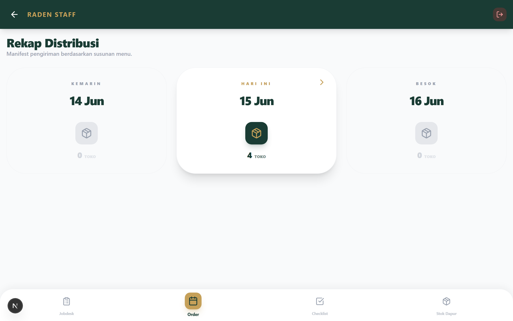
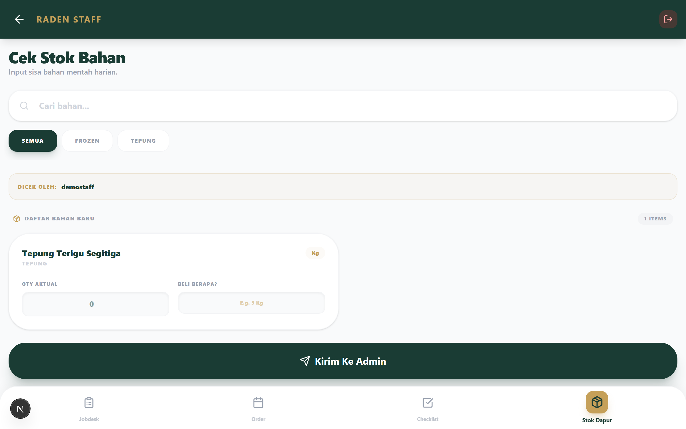

# 🥯 RADEN ERP — Integrated Bakehouse Management System

[](https://nextjs.org/)
[](https://supabase.com/)
[](https://tailwindcss.com/)
[](https://www.typescriptlang.org/)
[](https://www.framer.com/motion/)

**RADEN ERP** is a professional management system for a bakehouse that **produces in-house and distributes through multiple channels** (Agents, Branches, Online, plus its own counter). It connects the whole flow — production → distribution → multi-channel sales — into one secure, mobile-friendly app, replacing scattered spreadsheets.

---

## 🔐 Security & Access (database-level)

*   **Per-user login** via Supabase Auth (username + PIN). Two roles: **Admin** and **Staff**.
*   **Row Level Security on every table** — data is locked at the database, not just the UI. Logged-out requests see nothing; staff are limited to their own area; the cash book is admin-only.
*   **Admin-managed staff accounts** — create, remove, and reset staff PINs from the admin panel (via a secure server route holding the service key).

---

## 🌟 Key Features

### 👔 Administrator Suite
*   **Products & Stock**: per-channel pricing (**Eceran / Agen / Branch**), **Distok vs Fresh** (made-to-order) product types, optional **variants/isian** (e.g. martabak fillings), weekly targets that drive production recommendations.
*   **Branch & Agent** distribution network — manage partners with type, contact, and address.
*   **Orders (Pesanan)**: price is chosen **automatically by channel** (agent / branch / online-eceran); optional per-line filling; walk-in/online buyers by name; reserved-stock awareness; printable PDF invoices.
*   **Buku Kas** (cash ledger): income/expense with running balance and pagination.
*   **Production Calendar (Jobdesk)**: daily assignment with **smart restock recommendations** (🔴🟡🟢) based on weekly target vs current stock.
*   **Staff & Shift scheduling** with optional **AI parsing** of natural-language availability templates (Groq / Llama 3.3).
*   **Dashboard**: today's orders, active orders, and an accurate "needs production" panel (stocked products only).

### 👨‍🍳 Staff Operational Hub
*   **Daily Jobdesks**: stocked products report actual yield; fresh/made-to-order items simply confirm "done".
*   **Distribution Recap**: a per-store manifest with **filling breakdown** when specified.
*   **Material Stock Checks** & **Operational Checklists** (Pastry/Kitchen/General) — automatically attributed to the logged-in account.
*   **Mobile-Optimized** — designed for tablets/phones in the kitchen; installable to the home screen.

---

## 📸 Interface Preview

> Generated from the live app with `npm run screenshots` (see `scripts/screenshots.mjs`). Files live in `public/screenshots/`.

### 🔑 Login
Per-user access — username + PIN, no role picker.


### 👔 Administrator

**Dashboard** — active orders and what needs producing today (no revenue noise).


**Products & Stock** — per-channel pricing (retail / agent / branch), Distok vs Fresh, and optional fillings.


**Orders** — channel-aware pricing for branches, agents, and walk-ins.


**Branch & Agent** — the distribution partner network.


**Buku Kas** — income/expense ledger with running balance.


**Staff & Shift** — 30-day shift matrix.


### 👨‍🍳 Staff (mobile)

**Distribution Recap** — per-store delivery manifest by date.


**Material Stock Check** — daily raw-material count, auto-attributed to the logged-in account.


---

## 🛠️ Tech Stack

- **Framework**: [Next.js 16](https://nextjs.org/) (App Router, Turbopack)
- **Language**: [TypeScript](https://www.typescriptlang.org/)
- **Database & Auth**: [Supabase](https://supabase.com/) — PostgreSQL, Auth, **Row Level Security**
- **Styling**: [Tailwind CSS v4](https://tailwindcss.com/)
- **Animations**: [Framer Motion](https://www.framer.com/motion/)
- **Icons**: [Lucide React](https://lucide.dev/)
- **PDF Engine**: [@react-pdf/renderer](https://react-pdf.org/)
- **AI**: [Groq API](https://groq.com/) (Llama 3.3) — automated staff-schedule parsing

---

## 🚀 Getting Started

### Prerequisites
- Node.js 20.x or later
- A Supabase project
- (Optional) Groq API key for the AI schedule parser

### Installation

1. **Clone & install**
   ```bash
   git clone https://github.com/jbrandons13/raden.git
   cd raden
   npm install
   ```

2. **Environment** — create `.env.local`:
   ```env
   NEXT_PUBLIC_SUPABASE_URL=your_supabase_url
   NEXT_PUBLIC_SUPABASE_ANON_KEY=your_supabase_anon_key
   SUPABASE_SERVICE_ROLE_KEY=your_service_role_key
   GROQ_API_KEY=your_groq_key
   ```
   > Never commit `.env.local`. The `SUPABASE_SERVICE_ROLE_KEY` is server-only.

3. **Database**
   - Run `schema.sql` in the Supabase SQL Editor (creates all tables).
   - Then run every file in `supabase/migrations/` **in order** (adds RLS policies, the `user_role()` & `submit_task_result()` functions, and performance indexes).
   - Seed admin accounts: `node scripts/seed-admins.mjs` (prints usernames + PINs to `admin-credentials.txt`).

4. **Run**
   ```bash
   npm run dev        # development
   npm run build && npm start   # production
   ```

---

## 🏗️ Architecture

Next.js App Router under `src/app`:
- `/admin` — management dashboard & master data (products, branch/agent, orders, buku kas, jobdesk, staff, checklist, staff accounts).
- `/staff` — operational tools (jobdesk, distribution recap, stock check, checklist).
- `/api/admin/staff-accounts` — secure server route for staff-account management (service-key, admin-gated).
- `supabase/migrations/` — ordered SQL (RLS, functions, columns, indexes); `schema.sql` is the consolidated table reference.
- `scripts/` — ops utilities (seed admins, schema/RLS audits).

See **`PROGRESS.md`** for the full feature & migration checklist.

---

## 📄 License
Private — internal use. All rights reserved.

---

Developed with ❤️ for efficient bakehouse operations.
