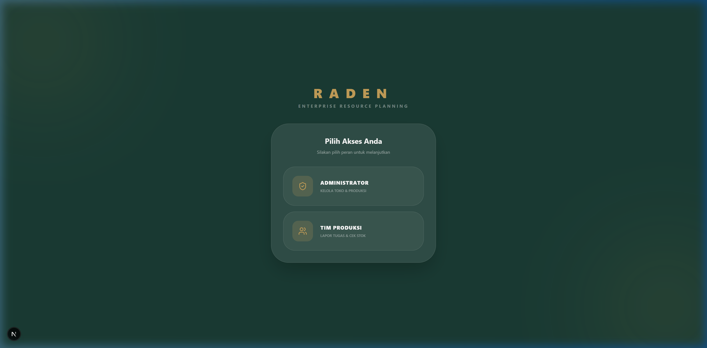
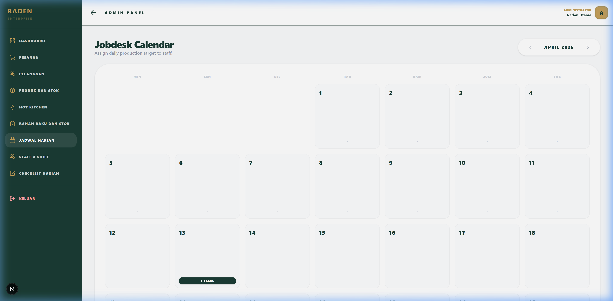
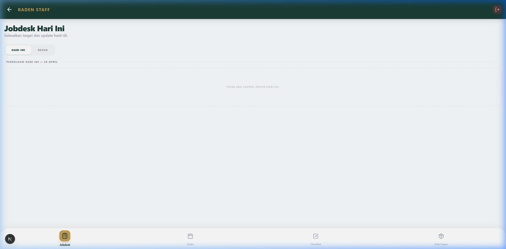
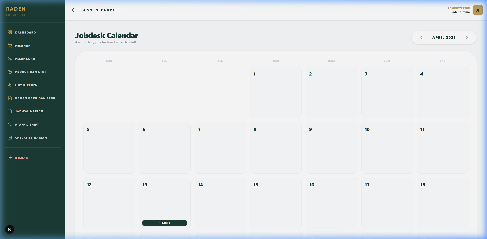

# 🥯 RADEN ERP — Integrated Bakehouse Management System

[](https://nextjs.org/)
[](https://supabase.com/)
[](https://tailwindcss.com/)
[](https://www.typescriptlang.org/)
[](https://www.framer.com/motion/)

**RADEN ERP** is a professional, high-performance Enterprise Resource Planning system specifically tailored for bakehouses and food production businesses. It bridges the gap between administrative oversight and kitchen operations, ensuring seamless inventory tracking, production scheduling, and financial reporting.

---

## 🌟 Key Features

### 👔 Administrator Suite
*   **Inventory Control**: Real-time tracking of finished products and raw materials with automated stock alerts.
*   **Production Planning**: Weekly and daily production target setting with yield estimation.
*   **Staff Scheduling**: Comprehensive shift management and staff attendance tracking.
*   **Customer & Sales Insights**: centralized database for customer orders, revenue tracking, and order history.
*   **Invoice Generation**: Professional PDF invoice generation for wholesale and retail customers.

### 👨‍🍳 Staff Operational Hub
*   **Daily Jobdesks**: Personalized task lists for kitchen staff, showing exact production targets and batch requirements.
*   **Real-time Stock Reporting**: Simple interface for staff to report actual production yields and material usage.
*   **Operational Checklists**: Integrated checklists (Pastry, Kitchen, General) to maintain high-quality standards and hygiene.
*   **Mobile-Optimized**: Designed to be used on tablets and smartphones directly in the kitchen environment.

---

## 📸 Interface Preview

### 🖥️ Main Portal
Access control for both Administrative and Production teams.


### 📊 Admin Dashboard
Comprehensive overview of the business operations.


### 🍞 Inventory & Products
Visual stock management with real-time status indicators.


### 📅 Production Calendar
Efficient scheduling for daily bakehouse targets.


### 👨‍🍳 Kitchen Operations
Simplified task management for the production team.


### 🗓️ Staff & Shift Management
Comprehensive 30-day shift matrix and daily staff scheduling.


### 📅 Daily Jobdesk Calendar
Visual task assignment for specific production goals.


---

## 🛠️ Tech Stack

- **Framework**: [Next.js 15+](https://nextjs.org/) (App Router, Turbopack)
- **Language**: [TypeScript](https://www.typescriptlang.org/)
- **Database & Auth**: [Supabase](https://supabase.com/) (PostgreSQL)
- **Styling**: [Tailwind CSS v4](https://tailwindcss.com/)
- **Animations**: [Framer Motion](https://www.framer.com/motion/)
- **Icons**: [Lucide React](https://lucide.dev/)
- **PDF Engine**: [@react-pdf/renderer](https://react-pdf.org/)
- **AI Integration**: [Groq API](https://groq.com/) (Llama 3.3) — Powers automated staff schedule parsing from natural language templates.

---

## 🚀 Getting Started

### Prerequisites
- Node.js 18.x or later
- A Supabase project
- Groq API Key

### Installation

1. **Clone the repository**
   ```bash
   git clone https://github.com/jbrandons13/raden.git
   cd raden
   ```

2. **Install dependencies**
   ```bash
   npm install
   ```

3. **Environment Configuration**
   Create a `.env.local` file in the root directory and add your credentials:
   ```env
   NEXT_PUBLIC_SUPABASE_URL=your_supabase_url
   NEXT_PUBLIC_SUPABASE_ANON_KEY=your_supabase_anon_key
   SUPABASE_SERVICE_ROLE_KEY=your_service_role_key
   FIXED_PIN=1234
   GROQ_API_KEY=your_groq_key
   ```

4. **Database Setup**
   Run the provided `schema.sql` in your Supabase SQL Editor to initialize the tables and relationships.

5. **Run the development server**
   ```bash
   npm run dev
   ```

6. **Build for production**
   ```bash
   npm run build
   npm start
   ```

---

## 🏗️ Architecture Overview

The project follows a modular structure within the Next.js `app` directory:
- `/admin`: Management dashboard and master data control.
- `/staff`: Operational tools and reporting interfaces.
- `/api`: Serverless functions for complex backend logic.
- `/components`: Reusable UI components powered by Tailwind and Framer Motion.

---

## 📄 License
This project is private and intended for internal use. All rights reserved.

---

Developed with ❤️ for efficient bakehouse operations.
